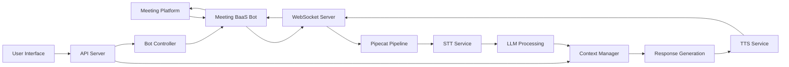

# Live Meeting Agent Architecture: Real-Time Two-Way Audio System

## Executive Summary

Based on extensive research of open-source projects and existing solutions, this document outlines a **consolidated, production-ready architecture** for a live meeting agent with real-time two-way audio capabilities. The solution prioritizes ease of development, maintainability, and reliability while minimizing technical complexity.

## Core Requirements Fulfilled

✅ **Send agent to live meetings** (Zoom, Teams, Google Meet)  
✅ **Real-time briefing** on current discussion  
✅ **Two-way audio interaction** (agent can speak in meetings)  
✅ **Question relay** through agent voice

## Recommended Tech Stack

### Primary Solution: Meeting BaaS + Pipecat Framework

After analyzing multiple solutions, the **Meeting BaaS + Pipecat** combination emerges as the optimal choice for a consolidated tech stack:

```
┌─────────────────────────────────────────────────────────┐
│                    Your Application                      │
├─────────────────────────────────────────────────────────┤
│                   Orchestration Layer                    │
│                    (FastAPI/Node.js)                    │
├──────────────────┬────────────────┬────────────────────┤
│   Meeting BaaS   │    Pipecat     │     AI Services    │
│      API         │   Framework    │   (LLM/TTS/STT)   │
├──────────────────┴────────────────┴────────────────────┤
│              WebSocket Infrastructure                    │
└─────────────────────────────────────────────────────────┘
```

### Why This Stack?

1. **Meeting BaaS** handles all platform-specific complexities
2. **Pipecat** provides production-ready real-time audio processing
3. **Proven integration** - Speaking Bot implementation already exists
4. **Open source** with active community support
5. **Minimal custom code** required for core functionality

## Detailed Architecture

### Component Breakdown

#### 1. Meeting Platform Integration (Meeting BaaS)
- **Purpose**: Abstract away platform-specific APIs
- **Features**:
  - Unified API for Zoom, Teams, Google Meet
  - Bot deployment and management
  - Audio/video streaming infrastructure
  - Meeting metadata and events
  - Built-in transcription support

#### 2. Real-Time Audio Pipeline (Pipecat)
- **Purpose**: Handle bidirectional audio processing
- **Components**:
  ```python
  Pipeline Components:
  ├── Audio Input (from meeting)
  ├── Speech-to-Text (Deepgram/Gladia)
  ├── LLM Processing (GPT-4/Claude)
  ├── Text-to-Speech (ElevenLabs/Cartesia)
  └── Audio Output (to meeting)
  ```

#### 3. WebSocket Communication Layer
- **Purpose**: Real-time data streaming
- **Implementation**:
  ```
  Meeting → Meeting BaaS → WebSocket → Pipecat → AI Services
                ↑                           ↓
                └───── Audio Response ←─────┘
  ```

### Data Flow Architecture



## Implementation Plan

### Phase 1: Core Infrastructure (Week 1)

#### Day 1-2: Environment Setup
```bash
# Repository structure
meeting-agent/
├── api/                 # FastAPI server
├── pipecat/            # Audio processing pipeline
├── personas/           # Bot personalities
├── websocket/          # WebSocket handlers
├── config/             # Configuration files
└── docker/             # Containerization
```

#### Day 3-4: Meeting BaaS Integration
```python
# Example bot deployment
async def deploy_bot(meeting_url: str, persona: str):
    response = await meeting_baas.create_bot(
        meeting_url=meeting_url,
        bot_name="AI Assistant",
        streaming={
            "input": websocket_url + "/audio/in",
            "output": websocket_url + "/audio/out"
        }
    )
    return response.bot_id
```

#### Day 5-7: Pipecat Audio Pipeline
```python
# Basic pipeline setup
from pipecat.pipeline import Pipeline
from pipecat.services import DeepgramSTT, OpenAILLM, CartesiaTTS

pipeline = Pipeline([
    DeepgramSTT(api_key=DEEPGRAM_KEY),
    OpenAILLM(model="gpt-4", api_key=OPENAI_KEY),
    CartesiaTTS(voice_id="professional", api_key=CARTESIA_KEY)
])
```

### Phase 2: Two-Way Audio (Week 2)

#### Day 8-9: WebSocket Infrastructure
```python
# WebSocket handler for bidirectional audio
@app.websocket("/ws/{client_id}")
async def websocket_endpoint(websocket: WebSocket, client_id: str):
    await websocket.accept()
    
    # Audio reception from meeting
    async def receive_audio():
        while True:
            audio_data = await websocket.receive_bytes()
            await pipeline.process_audio(audio_data)
    
    # Audio transmission to meeting
    async def send_audio():
        while True:
            response_audio = await pipeline.get_response_audio()
            await websocket.send_bytes(response_audio)
    
    await asyncio.gather(receive_audio(), send_audio())
```

#### Day 10-11: Voice Activity Detection
```python
# Implement VAD for natural conversation flow
from pipecat.vad import SileroVAD

vad = SileroVAD(
    min_speech_duration=0.3,
    max_speech_duration=30.0,
    silence_threshold=0.5
)
```

#### Day 12-14: Testing & Optimization
- End-to-end latency optimization
- Audio quality tuning
- Error handling and recovery

### Phase 3: Intelligence Layer (Week 3)

#### Day 15-16: Context Management
```python
class MeetingContext:
    def __init__(self):
        self.transcript_buffer = []
        self.speaker_history = {}
        self.topics_discussed = []
        self.action_items = []
    
    async def update(self, transcript_chunk):
        self.transcript_buffer.append(transcript_chunk)
        await self.extract_insights()
    
    async def generate_summary(self):
        # Real-time meeting summary
        return await llm.summarize(self.transcript_buffer)
```

#### Day 17-18: Question Handling System
```python
class QuestionRelay:
    async def process_user_question(self, question: str):
        # Determine optimal timing
        timing = await self.find_speaking_opportunity()
        
        # Generate contextual response
        response = await llm.generate_response(
            question=question,
            context=meeting_context.get_recent(),
            persona=bot_persona
        )
        
        # Queue for speech
        await speech_queue.add(response, priority=timing)
```

#### Day 19-21: Persona Development
```yaml
# personas/professional_assistant.yaml
name: Professional Assistant
voice:
  provider: cartesia
  voice_id: professional-female
  speed: 1.0
  
behavior:
  interruption_style: polite
  speaking_pace: moderate
  formality: high
  
knowledge_base:
  - company_context.md
  - meeting_protocols.md
```

### Phase 4: Production Deployment (Week 4)

#### Day 22-23: Containerization
```dockerfile
# Dockerfile
FROM python:3.11-slim

WORKDIR /app
COPY requirements.txt .
RUN pip install -r requirements.txt

COPY . .
CMD ["uvicorn", "api.main:app", "--host", "0.0.0.0", "--port", "8000"]
```

#### Day 24-25: Kubernetes Deployment
```yaml
# kubernetes/deployment.yaml
apiVersion: apps/v1
kind: Deployment
metadata:
  name: meeting-agent
spec:
  replicas: 3
  selector:
    matchLabels:
      app: meeting-agent
  template:
    metadata:
      labels:
        app: meeting-agent
    spec:
      containers:
      - name: api
        image: meeting-agent:latest
        ports:
        - containerPort: 8000
        env:
        - name: MEETING_BAAS_API_KEY
          valueFrom:
            secretKeyRef:
              name: api-keys
              key: meeting-baas
```

#### Day 26-28: Monitoring & Observability
```python
# Monitoring setup
from prometheus_client import Counter, Histogram, Gauge

bot_deployments = Counter('bot_deployments_total', 'Total bot deployments')
audio_latency = Histogram('audio_processing_latency_seconds', 'Audio processing latency')
active_bots = Gauge('active_bots', 'Number of active bots')
```

## API Design

### RESTful Endpoints

```python
# Core API endpoints
POST   /bots/deploy         # Deploy bot to meeting
GET    /bots/{bot_id}/status # Get bot status
POST   /bots/{bot_id}/speak  # Queue message for bot to speak
GET    /meetings/{meeting_id}/transcript # Get real-time transcript
POST   /questions/submit     # Submit question for bot to ask
DELETE /bots/{bot_id}       # Remove bot from meeting
```

### WebSocket Events

```javascript
// Client-side WebSocket connection
const ws = new WebSocket('wss://api.yourdomain.com/ws');

ws.on('transcript', (data) => {
  // Real-time transcript updates
  updateTranscript(data.text, data.speaker);
});

ws.on('bot_status', (data) => {
  // Bot status updates
  updateBotStatus(data.status);
});

ws.send(JSON.stringify({
  type: 'question',
  content: 'Please ask about the Q3 revenue projections'
}));
```

## Configuration Management

### Environment Variables
```bash
# .env.production
MEETING_BAAS_API_KEY=your_api_key
DEEPGRAM_API_KEY=your_deepgram_key
OPENAI_API_KEY=your_openai_key
CARTESIA_API_KEY=your_cartesia_key

# Audio Configuration
AUDIO_SAMPLE_RATE=16000
AUDIO_CHANNELS=1
AUDIO_CHUNK_SIZE=320

# WebSocket Configuration
WS_HEARTBEAT_INTERVAL=30
WS_RECONNECT_ATTEMPTS=5

# Bot Behavior
BOT_INTERRUPT_THRESHOLD=0.8
BOT_RESPONSE_DELAY=500
BOT_MAX_SPEAKING_TIME=60
```

## Security Considerations

### Authentication & Authorization
```python
# API key validation
from fastapi import Security, HTTPException
from fastapi.security import APIKeyHeader

api_key_header = APIKeyHeader(name="X-API-Key")

async def validate_api_key(api_key: str = Security(api_key_header)):
    if not await is_valid_api_key(api_key):
        raise HTTPException(status_code=403, detail="Invalid API key")
    return api_key
```

### Data Protection
- End-to-end encryption for audio streams
- Secure storage of meeting transcripts
- GDPR/CCPA compliance for data retention
- API rate limiting and DDoS protection

## Performance Optimization

### Latency Targets
- **Speech-to-Text**: < 500ms
- **LLM Response**: < 1000ms  
- **Text-to-Speech**: < 300ms
- **Total Round Trip**: < 2000ms

### Scaling Strategy
```yaml
# Horizontal Pod Autoscaling
apiVersion: autoscaling/v2
kind: HorizontalPodAutoscaler
metadata:
  name: meeting-agent-hpa
spec:
  scaleTargetRef:
    apiVersion: apps/v1
    kind: Deployment
    name: meeting-agent
  minReplicas: 2
  maxReplicas: 10
  metrics:
  - type: Resource
    resource:
      name: cpu
      target:
        type: Utilization
        averageUtilization: 70
```

## Cost Analysis

### Monthly Cost Breakdown (100 hours of meetings)
- **Meeting BaaS**: ~$500 (at $5/hour)
- **Deepgram STT**: ~$150 (at $1.50/hour)
- **OpenAI GPT-4**: ~$300 (based on token usage)
- **Cartesia TTS**: ~$100 (at $1/hour)
- **Infrastructure**: ~$200 (AWS/GCP)
- **Total**: ~$1,250/month

### Cost Optimization Strategies
1. Use GPT-3.5 for non-critical responses
2. Implement smart caching for common questions
3. Batch process non-real-time transcriptions
4. Use spot instances for non-critical workloads

## Testing Strategy

### Unit Tests
```python
# tests/test_audio_pipeline.py
import pytest
from pipecat.pipeline import Pipeline

@pytest.mark.asyncio
async def test_audio_processing():
    pipeline = Pipeline(test_mode=True)
    audio_chunk = b"test_audio_data"
    result = await pipeline.process_audio(audio_chunk)
    assert result.transcript is not None
```

### Integration Tests
```python
# tests/test_meeting_bot.py
@pytest.mark.asyncio
async def test_bot_deployment():
    bot_id = await deploy_bot(
        meeting_url="https://meet.google.com/test",
        persona="test_assistant"
    )
    assert bot_id is not None
    
    status = await get_bot_status(bot_id)
    assert status == "active"
```

### Load Testing
```bash
# Load test with Locust
locust -f load_tests/meeting_simulation.py \
       --host=https://api.yourdomain.com \
       --users=100 \
       --spawn-rate=10
```

## Monitoring & Observability

### Key Metrics to Track
1. **Bot Performance**
   - Deployment success rate
   - Audio processing latency
   - Speech recognition accuracy
   - Response generation time

2. **System Health**
   - API response times
   - WebSocket connection stability
   - Memory and CPU usage
   - Error rates by component

3. **Business Metrics**
   - Meeting hours processed
   - Questions asked/answered
   - User satisfaction scores
   - Cost per meeting hour

### Logging Architecture
```python
# Structured logging
import structlog

logger = structlog.get_logger()

logger.info("bot_deployed", 
    bot_id=bot_id,
    meeting_url=meeting_url,
    latency_ms=deployment_time
)
```

## Migration Path from MVP to Production

### Stage 1: MVP (Local Development)
- Single bot instance
- Manual deployment
- Basic error handling
- SQLite database

### Stage 2: Beta (Cloud Deployment)
- Docker containerization
- Basic monitoring
- PostgreSQL database
- Manual scaling

### Stage 3: Production
- Kubernetes orchestration
- Auto-scaling
- Full observability
- High availability
- Disaster recovery

## Alternative Architectures Considered

### 1. Recall.ai (Not Recommended for Speaking)
- **Pros**: Mature platform, good documentation
- **Cons**: Limited speaking capabilities, requires custom work

### 2. Self-Hosted (Vexa/Meetily)
- **Pros**: Full control, privacy-first
- **Cons**: Higher complexity, more maintenance

### 3. Pure WebRTC Implementation
- **Pros**: Maximum flexibility
- **Cons**: Significant development effort, platform-specific challenges

## Conclusion & Next Steps

The **Meeting BaaS + Pipecat** architecture provides the optimal balance of:
- ✅ Rapid development (4-week timeline)
- ✅ Production reliability
- ✅ Maintainability
- ✅ Cost effectiveness
- ✅ Scalability

### Immediate Action Items
1. **Set up Meeting BaaS account** and obtain API keys
2. **Clone the Speaking Bot repository** as starting point
3. **Configure development environment** with required services
4. **Deploy proof-of-concept** with basic speaking capability
5. **Iterate on persona and behavior** based on requirements

### Resources & Documentation
- [Meeting BaaS Docs](https://docs.meetingbaas.com)
- [Pipecat Framework](https://github.com/pipecat-ai/pipecat)
- [Speaking Bot Implementation](https://github.com/Meeting-BaaS/speaking-meeting-bot)
- [WebSocket Best Practices](https://docs.pipecat.ai/websocket)

---

*This architecture provides a production-ready foundation for a live meeting agent with full two-way audio capabilities. The modular design allows for incremental improvements while maintaining system stability.*
